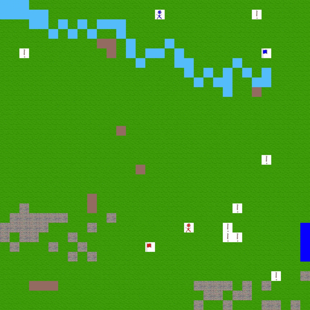

Among AIs
---
Among AIs is a PC Game we developed as part of the [Smart Applications](https://esami.unipi.it/esami2/programma.php?c=36618) course @ [Department of Computer Science](https://di.unipi.it/en/?start=25) of [University of Pisa](https://unipi.it), under the supervision of prof. Gervasi.
It's inspired by the well-known "Among Us" game, and its main purpose it's to develop and let play AI agents (then it's 
been expanded to support also human players). Everything has been built following an agile development, with the entire class
taking part (from brainstorming to development of each team's component). 

The game is structured in matches (and tournaments) in which two teams of agents (AI / humans) have the goal to catch the opponent's flag and 
kill the enemies. Agents can also be "impostors", so it take step the "social game" in which the agents have to spot the real 
impostor and vote to kick him. There's also the Turing Game, which aim is simply to correctly classify the players in "humans" or "AIs". 
There's also the chat available. 

In this repository we present the code about the agent we developed as team 7 ([Gabriele Pisciotta](https://github.com/GabrielePisciotta), [Fabio Murgese](https://github.com/FabioMurgese), [Antonio Di Mauro](https://github.com/antodima)),
accompanied by the server to test the game (credits to prof. Gervasi) and a PC client (credits to Jessica Sartori, 
Luca Roveroni, and Marco Lepri).

There's also the possibility to use a [web app](http://amongais.altervista.org/) to join / spectate the game, but it strictly depends from the game server 
being run at University of Pisa's servers, so don't expect to be properly able to play if the server will be shut down in
the future.

## Detailed documentations
Take a look at our [report](REPORT.pdf), where we describe the architecture and all the algorithms implemented to animate 
our agent. Please take note that the code is something that's been built quick&dirty! :)

To better understand the dynamics of the game, look at the [protocol cheatsheets](PROTOCOL.pdf).

